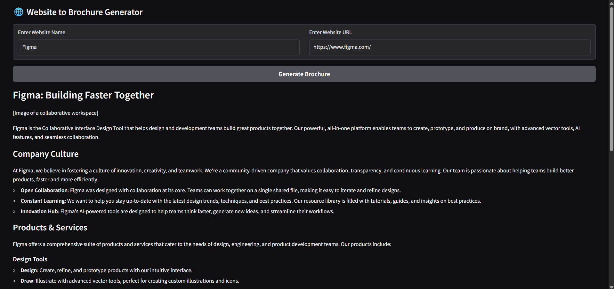

# 🌐 Website to Brochure Generator

A **Gradio-based web app** that generates a short, professional brochure for a company based on its website. The app uses a **local LLaMA-based LLM** to analyze the content of the website and produce an engaging brochure in Markdown format.

---

## Features

- Input **website name** and **URL**.  
- Automatically fetches relevant pages and analyzes content.  
- Generates a **concise brochure** including:
  - Company overview
  - Products or services
  - Company culture
  - Customers / partners
  - Careers / job opportunities (if available)  
- Streaming output for live brochure generation.  
- Easy to run locally using Gradio.

---

## Preview


 


---

## Installation

1. Clone the repository:

```bash
git clone https://github.com/yourusername/brochure-generator.git
cd llm_brochureGenerator
